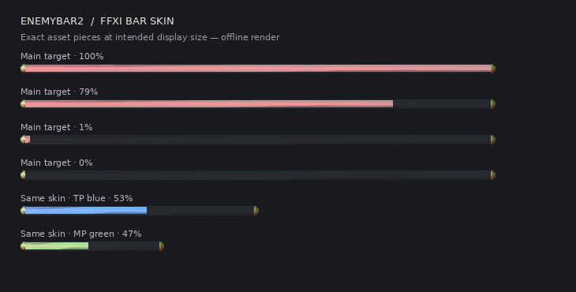

# enemybar2

This is an addon for Windower4 for FFXI. It creates a big health bar for the target to make it easy to see.

The `ffxi-bar-skin-2026-10-07` branch contains the native gauge prototype. Revision `1.1.1-a.20261007.4` uses the actual `menu/gauge` texture extracted from the supplied `51.DAT`. The empty center is approximately 50% opaque (128/255); native caps and colored fill retain full opacity. Main target and aggro bars use the native skin by default, with HP pink and pale MP green respectively. Subtarget and focus retain the classic skin.

New positions use the client's current UI resolution. The main gauge is centered horizontally with its bottom edge 60 pixels above the screen bottom; subtarget and focus sit 30 and 60 pixels above it. The aggro stack sits on the right and accounts for stack direction and row spacing. Saved positions take precedence. Use `//eb resetpos` to recover the main bar after changing resolution, `//eb resetpos a` for aggro, or `//eb resetpos all` for every frame. Resets use current widths and save the resulting positions. On a 1280×720 client, `//eb set width t 400` followed by `//eb resetpos` gives a shorter centered main gauge. Width is not automatically changed.

Native HP fills slide to a new value over 0.18 seconds in either direction. Repeated HP samples do not restart the slide; an interrupted slide continues from the displayed edge. First appearance, target changes and aggro-row reassignment snap immediately, using monster IDs rather than names. The displayed HP percentage remains current. The aggro stack omits the primary target while its main bar is enabled and skips missing monsters without consuming rows.



This is an offline composition of the shipped PNGs at their display dimensions. The blue and green examples show the same pieces at other widths and tints. The source texture is native; the large-bar proportions, tinted fill and dark backing are addon adaptations. Actual Windower filtering still needs visual comparison in-game.

The first prototype could appear as separated, oversized pieces after loading, then correct itself when dragged. This revision reapplies the dimensions of all six pieces on each visible draw, including when HP remains at 100%. The Lua image library caches requested dimensions, which is insufficient to detect a later texture-size reset in the renderer. Newly constructed bars also stay hidden until their first target/setup update.

To install the testing package, merge its `enemybar2` directory into `Windower/addons`, replacing the included files in the existing addon folder. The package includes no `data` directory, so existing character settings remain available. Reload and explicitly select the prototype and HP pink, since an existing saved color takes precedence over the new default:

```text
//lua reload enemybar2
//eb set skin t ffxi
//eb set color t 255 149 151
//eb set skin a ffxi
//eb set color a 209 224 151
//eb set show a on
//eb setup
```

Use `//eb setup` again to return to live targeting. Setup retains the existing drag and Ctrl-snap controls. If the saved position is outside the current viewport, `//eb set pos t 120 120` brings the test gauge into view. First reload while targeting a full-HP NPC or enemy, without entering setup or dragging: the entire gauge should appear at the saved size immediately. Then test partial and empty HP, switching targets, clearing the target, dragging, and reloading. `//eb set skin t classic` restores the original renderer. Both skins use the same existing width/color commands.

Combat tracking, action/attention displays, debuff handling and text placement retain their existing behavior. Distance, action and target indicators remain off by default. Offline tests cover geometry, deferred texture-size recovery, animation, target identity, aggro selection, commands and cleanup; visual filtering and actual game behavior still need a Windower/FFXI test.

Developers can rebuild the six PNG pieces with `python tools/build_skin.py` (Python 3 and Pillow; uses the checked-in native atlas), and run `lua tests/gauge_spec.lua` from the repository root. To extract again from the supplied DAT, use `python tools/build_skin.py --dat /path/to/51.DAT`. The tests check zero/tiny/full HP, fixed shell dimensions, delayed source-size resets at unchanged HP, hidden initial state, movement and hover, both renderers, repeated recreation and complete primitive cleanup.


### Commands:
target_frame = **t**arget/**s**ub**t**arget/**f**ocus**t**arget/**a**ggro/all. Specifies which target frame to update the settings for, or all of them.

| Command | Action |
| --- | --- |
| //eb setup/debug/demo/test | Activate setup mode. Enables draging target frames and displays everything with your current settings. Ctrl-drag to snap to grid. |
| //eb resetpos [target_frame] | Repositions and saves the selected frame using current UI dimensions and width; defaults to the main target. Use all to recover every frame. |
| //eb focustarget/ft [target name] | Specifies a focus target. The focus target frame will display this target's hp and status. |
| //eb **s**et pos *target_frame* x y | Moves a target frame to a specified position |
| //eb **s**et color *target_frame* red green blue | Specifies the hp bar color for the given target frame |
| //eb **s**et skin *target_frame* ffxi/classic | Selects the new gauge skin or the original renderer for a frame. |
| //eb **s**et background_alpha *target_frame* 0..255 | Native empty-trough opacity; default 128 (about 50%). Caps and fill are unaffected. |
| //eb **s**et animation_duration *target_frame* 0..2 | Native HP slide duration in seconds; default 0.18. Zero disables animation. |
| //eb **s**et count *target_frame* i | Specifies the number of aggro'd monsters to display in the aggro frame |
| //eb **s**et stack_dir *target_frame* up/down | Specifies the stack direction of the aggro frame. Up stacks upwards, down stacks downwards |
| //eb **s**et stack_padding *target_frame* i | Specifies the distance between the target bars in the aggro frame |
| //eb **s**et font *target_frame* font_name | Specifies the font name for the given target frame. |
| //eb **s**et font_size *target_frame* i | Specifies the font size for the given target frame. |
| //eb **s**et width *target_frame* i | Specifies the width of the hp bar for the given target frame. |
| //eb **s**et show *target_frame* **t**rue/**f**alse/on/off/**y**es/**n**o | Display the given target frame. |
| //eb **s**et show_target_icon *target_frame* **t**rue/**f**alse/on/off/**y**es/**n**o | Display whether the enemy is targeted or not in the given target frame. |
| //eb **s**et show_target *target_frame* **t**rue/**f**alse/on/off/**y**es/**n**o | Display the target of the target in the given target frame. |
| //eb **s**et show_debuff *target_frame* **t**rue/**f**alse/on/off/**y**es/**n**o | Display the debuffs on the target in the given target frame. |
| //eb **s**et show_action *target_frame* **t**rue/**f**alse/on/off/**y**es/**n**o | Display the current action of the target in the given target frame. |
| //eb **s**et show_dist *target_frame* **t**rue/**f**alse/on/off/**y**es/**n**o | Display the distance from the target in the given target frame. |
| //eb help | Shows help text for this addon |

UPDATE: 1.1
Updates;
- unified healbar creation and management logic
Added several things:
- focus target function to track a specified target's status
- mob action (spell/ws) and attention tracking (not quite enmity, but close)
- aggro'd mobs can now be displayed as a stack of health bars + their action and attention
- display for target/subtarget/focustarget/aggro'd mobs' distance.
- indicator on aggro'd mobs' health bars for which is targeted.
- indicator on target/subtarget/focustarget/aggro'd mobs for crowd control status effects
